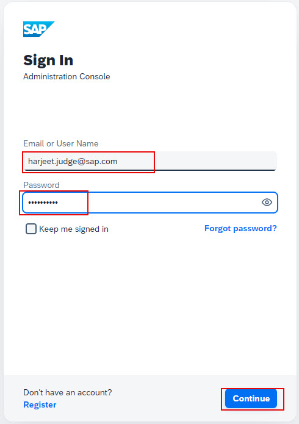
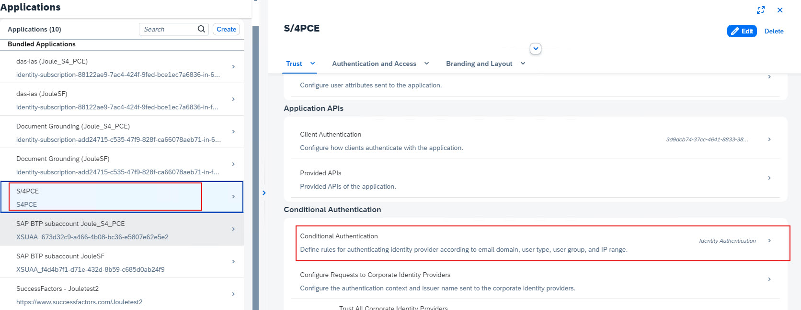
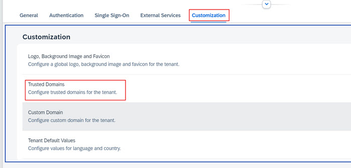

## **Update application configuration in SAP Cloud Identity Authentication Service**

1. Access the administration console of SAP Cloud Identity Services tenant using one of the URL formats below:
  * https://your-ias-tenant.accounts.ondemand.com/admin
  * https://your-ias-tenant.accounts.cloud.sap/admin              
**Note**: Substitute your-ias-tenant with your actual tenant's name.

2. Authenticate using an administrator user.               

3. From the menu, access **Applications & Resource >> Applications**. 

4. Select your SAP S/4HANA application and click on **Conditional Authentication**. 

5. Validate the **Conditional Authentication** settings for the application, but do not change anything in the existing setup.  The settings here would fall into one of the following 3 scenarios:
 * Scenario 1: S/4HANA application is setup to use Identity Authentication as the Default Identity Provider
 * Scenario 2: S/4HANA application is setup to use Identity Authentication as the Default Identity Provider but there are conditional rules setup to delegate   authentication to a 3rd party corporate IDP
 * Scenario 3: 3rd party IDP is setup as the Default Identity Provider eg. OKTA in my screenshot below. 

6. Switch to the application created for Joule by the BTP booster that was executed earlier.  The application name should be with the format **das-ias (Name of your subaccount)**. Set the **Conditional Authentication** settings for this application to match exactly what was set for the SAP S/4HANA application.  For eg. if the S/4HANAN application is setup with Scenario 3, you must also change Default Identifier in this application accordingly.                

## **Update Trusted Domains settings**

1. From the menu, access **Applications & Resource >> Tenant Settings**. 

2. Click **Customization** >> **Trusted Domains**. 

3. If necessary, click **Add** to add the domain of your SAP S/4HANA tenant and click **Save**.     

