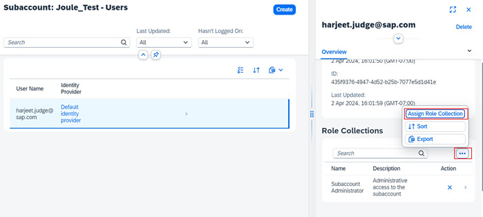
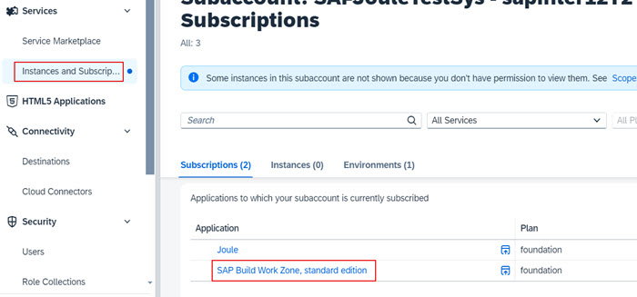
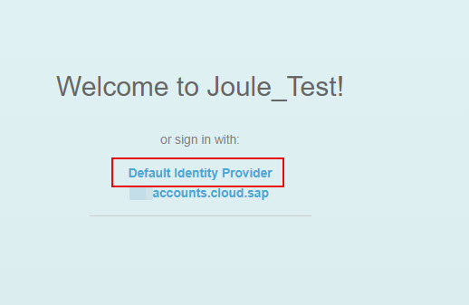
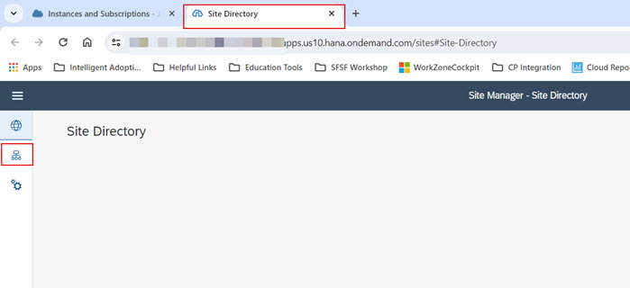
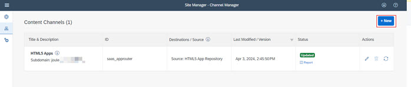
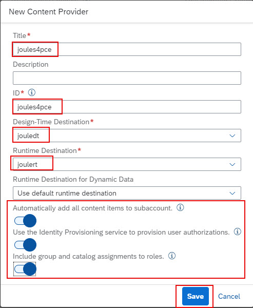
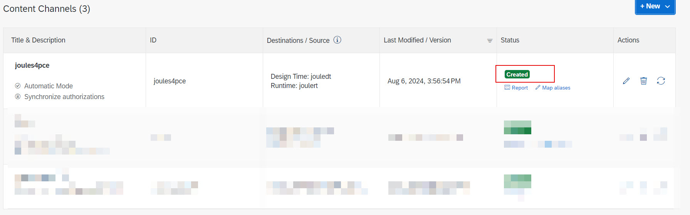

1. From the Navigation Pane on the left, select **Security >> Users** and click the arrow to open user details. 

2. Scroll down to role collections section and click **Additional Details** icon >> **Assign Role Collections**.  
   

3. Select the **Launchpad_Admin** and click **Assign Role Collection**. 
 

4. From the Navigation Pane on the left, select **Instances and Subscriptions***. Click **SAP Build Work Zone, standard edition** to launch the application.   
 

5. If prompted to choose the authentication provider, click **Default Identity Provider**. 
 

6. Click **Channel Manager** icon.      
  

7. Click **+New**.           

8. Add a new content provider using the information below and click **Save**:
  * Title: <-- Title of your choice eg. **joules4pce** -->
  * Design-Time Destination: <-- Design time destination created earlier eg. **jouledt** -->
  * Runtime Destination: <-- Runtime destination created by the booster eg. **joulert** -->
  * Runtime Destination for Dynamic Data: **Use default runtime destination**
  * Automatically add all content items to subccount: **toggle enabled**
  * Use the Identity Provisioning Service to provision user authorizations: **toggle enabled**
  * Include group and catalog assignment to roles: **toggle enabled**                
**Note**: Make a note of the **ID** that is generated automatically on this screen.  This ID is required when we setup the user provisioning job to SAP Build Work Zone in later steps.                          

9. Confirm the content provider is successfully created.                                        

