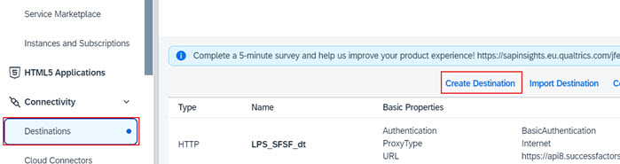
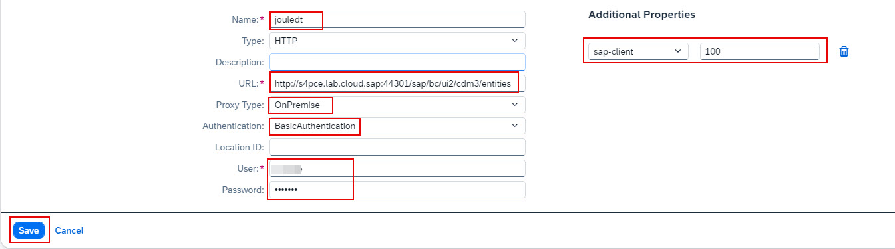
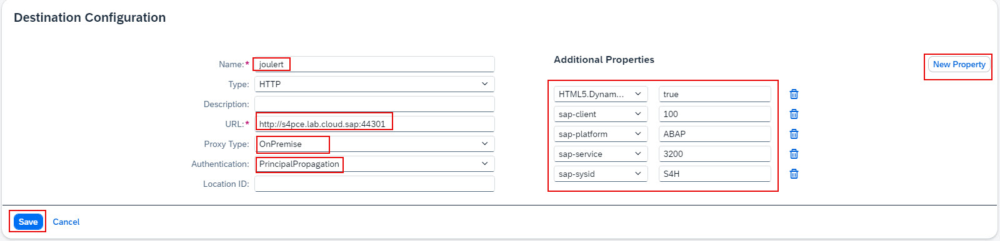
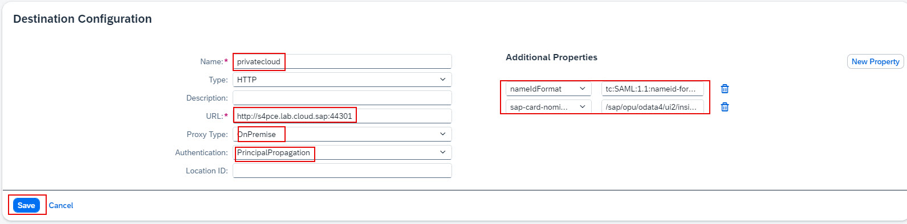

1. From the Navigation Pane on the left, select **Connectivity >> Destinations**.  Click **Create Destination**.

2. Specify the information below to create the destination and click **Save**:
  * Name: **NavigationService**
  * Type: **HTTP**
  * URL: <--**portal-service** url from the key file downloaded earlier-->
  * Proxy Type: **Internet**
  * Authentication: **OAuth2UserTokenExchange**
  * Token Service URL: <--**url** field from the key file downloaded earlier.  Make sure to add **/oauth/token** to end of the URL-->
  * Token Service URL Type: **Dedicated**
  * Client ID: <--**clientid** from key file downloaded earlier-->
  * Client Secret: <--**clientsecret** from key file downloaded earlier-->
  * Use default JDK truststore: **checked** 

 
3. Click **Create Destinations** to create a new destination using the information below and click **Save**:
  * Name: **jouledt**
  * Type: **HTTP**
  * URL: https://S4virtualhost:port/sap/bc/ui2/cdm3/entities  (See Cloud Connector Configuration to get Virtual Host and Port for your system)
  * Proxy Type: **OnPremise**
  * Authentication: **BasicAuthentication**
  * Location ID: <--Location ID specified in Cloud Connector (if any) -->
  * User: <-- S4 username with right access (see preparation section for more information) -->
  * Password: <-- Password for the user above -->
  * Use default JDK truststore: **checked**
  * **New Property** >> **sap-client**: **<--Client ID of your S4 tenant-->** 
 
  
4. Click **Create Destinations** to create a new destination using the information below and click **Save**:
   * Name: **joulert**
  * Type: **HTTP**
  * URL: **https://S4virtualhost:port**  (See Cloud Connector Configuration to get Virtual Host and Port for your system)
  * Proxy Type: **OnPremise**
  * Authentication: **BasicAuthentication**
  * User: <-- S4 username with right access (see preparation section for more information) -->
  * Password: <-- Password for the user above -->
  * Location ID: <--Location ID specified in Cloud Connector (if any) -->
  * Use default JDK truststore: **checked**
  * **New Property** >> **sap-client**: **<--Client ID of your S4 tenant-->**
  * **New Property** >> **sap-platform**: **ABAP**
  * **New Property** >> **sap-service**: **<--Instance number of your S4 system with 00 appended to the end-->**
  * **New Property** >> **sap-sysid**: **<-- System ID of your S4 system-->**
  * **New Property** >> **HTML5.DynamicDestination**: **true** 
 

5. Click **Create Destinations** to create a new destination using the information below and click **Save**:
   * Name: **privatecloud**
  * Type: **HTTP**
  * URL: **https://S4virtualhost:port**  (See Cloud Connector Configuration to get Virtual Host and Port for your system)
  * Proxy Type: **OnPremise**
  * Authentication: **Principal Propagation**
  * Location ID: <--Location ID specified in Cloud Connector (if any) -->
  * Use default JDK truststore: **checked**
  * **New Property** >> **nameIdFormat**: **tc:SAML:1.1:nameid-format:emailAddress**
  * **New Property** >> **sap-card-nominations-path**: **/sap/opu/odata4/ui2/insights_srv/srvd/ui2/insights_cards_read_srv/0001/CEP_Cards?$expand=DescriptorResources** 
  

