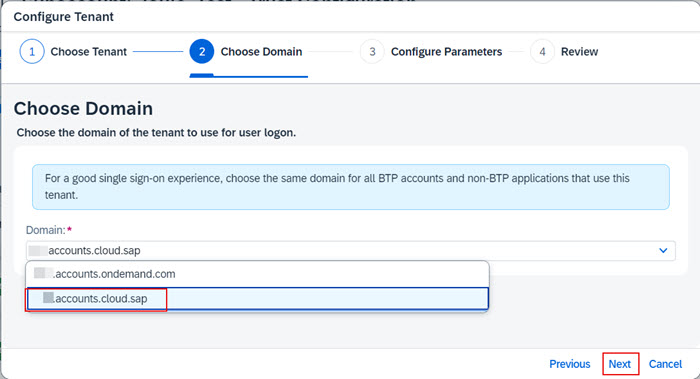
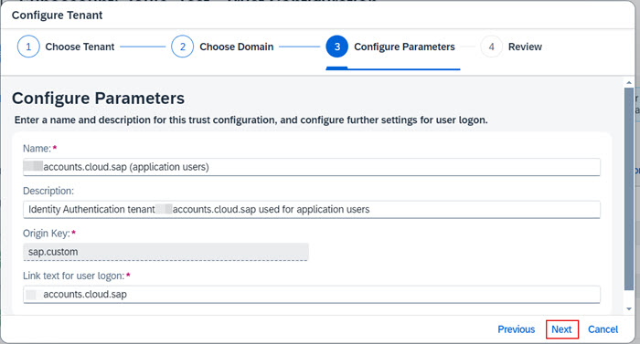
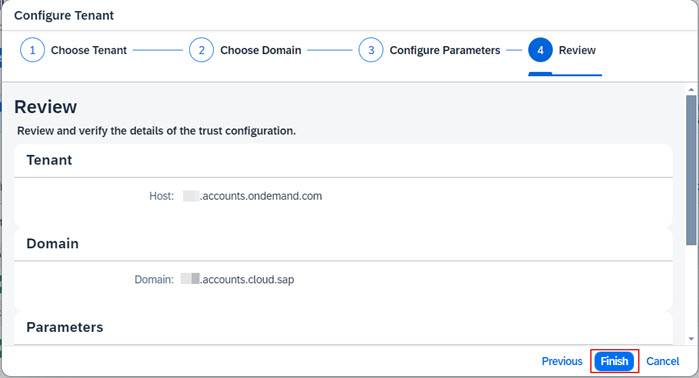

1. From the Navigation Pane on the left, select **Trust Configuration**.  Click **Establish Trust**. 

2. From the list of available SAP Cloud Identity Services tenants, choose the one that is also used by your S/4HHANA instance and click **Next**.      
**Note**: It's important to the choose the correct SAP Cloud Identity Services tenant.  The tenant chosen here must be the same as the one used by S/4HANA instance for which Joule is being configured.       
   

3. From the Domain dropdown make sure to choose **<yourtenanthost>.accounts.cloud.sap** and click **Next**.          
       

4. Leave the default settings and click **Next**.         

5. Review the information is correct and click **Finish**.                                                        

6. Confirm the new trust with SAP Cloud Identity Services is visible under **Custom Identity Provider for Applications**.                                      

