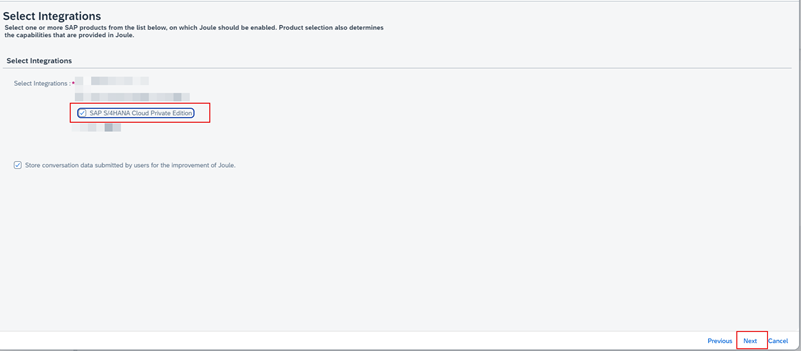

1. In BTP Cockpit, navigate to your BTP Global Account. 

3. From the Navigation Pane on the left, click **Boosters** >> search for **Joule** >> click **Start** on Setting up Joule tile. 

5. Confirm the pre-requisites check is successful and click **Next**. 

7. From the Subaccount dropdown select the **Joule** subaccount created earlier and click **Next**. 

9. Choose **SAP S/4HANA Cloud Private Edition** and click **Next**. 

11. Click **Next**.
12. Validate the information on the summary screen and click **Finish**. 

14. Confirm the booster execution is successful and click **Close**. 

